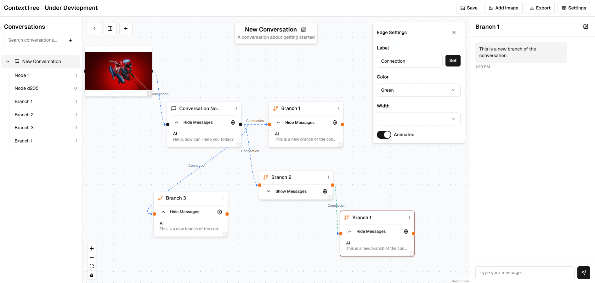

# 🧠 ContextTree
### (UNDER DEVLOPMENT)
BASE URL : https://v0-context-tree.vercel.app/
Link : https://chinmaypisal.notion.site/

is a React-based, interactive canvas application designed to enhance chatbot conversations by allowing users to create and navigate sub-conversations (branches) without losing context in the main discussion.

## 🚀 Project Overview

### Problem Statement
Current chatbot interfaces struggle with **context fragmentation** when users branch off to explore clarifications or dive deeper into specific terms. This leads to:

- **Cluttered conversations**: Side discussions mix with the main thread.  
- **Lost context**: Returning to the main flow is confusing after lengthy detours.  
- **Disrupted learning**: Users studying complex topics lose track of their original questions.  

### Solution: ContextTree
ContextTree solves these issues by introducing a **node-based canvas** where:

1. **Main Conversation**: Displayed linearly as a series of connected nodes.  
2. **Subgraph References**: Represent side discussions as **Subgraph Nodes**—clickable pointers that expand on demand.  
3. **Lazy Loading**: Canvas only shows pointers by default, reducing visual clutter and improving performance.  

This design mirrors how researchers open new tabs for deep dives, maintaining focus on the main task.

---

## 🎯 Key Features

- **Node-based UI**: Every message (or subgraph pointer) is a distinct node.  
- **Subgraph Expansion**: Click a Subgraph Node to expand its branch in a focused view.  
- **Context Isolation**: Main thread and subgraphs do not share context, preventing cross-talk.
- **Try Each Response Diffrent LLM Model**: try out at conetxt stage what other LLMs will response and Continue with that. 
- **API-driven**: Frontend fetches only necessary data via RESTful endpoints.  
- **Responsive Canvas**: Pan, zoom, and minimap support for easy navigation.  

---

Subgraph Pointer

Expanded Subgraph View

🤝 Contributing
Contributions are welcome! Please open issues or pull requests to discuss improvements.

📄 License
This project is released under the MIT License.
